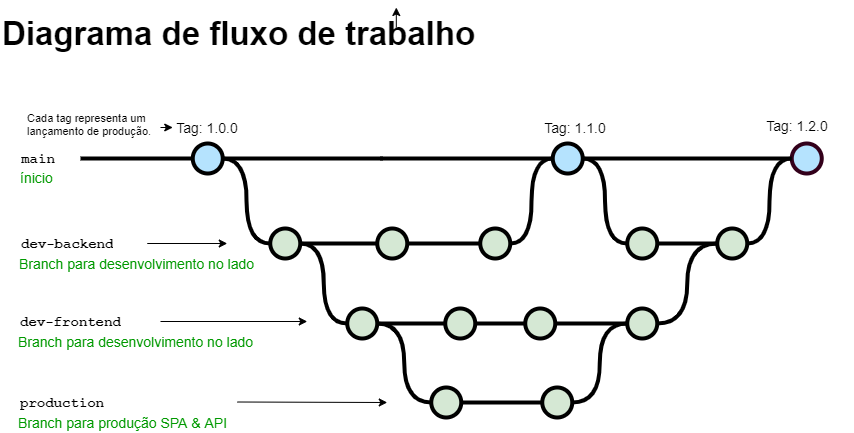

<p align="center">
 
 <h2 align="center">FullStack 2021</h2>
 <p align="center">
    Caixa Eletrônico do Vitto Mini Bank</p>
 </p>
  <p align="center">
    <a href="https://github.com/ahsouza/github-readme-stats/actions">
      
    </a>
    <a href="https://codecov.io/gh/ahsouza/github-readme-stats">
      
    </a>
    <a href="https://a.paddle.com/v2/click/16413/119403?link=1227">
      
    </a>
    <a href="https://a.paddle.com/v2/click/16413/119403?link=2345">
      
    </a>
  </p>
  <div style="display: flex" align="center">
            
  </div>
</p>

<br>
<br>
<br>


## Workspace
<p>
  <div style="display: flex" align="center">
    
  </div>
</p>


## Estrutura de Arquivos & Pastas

```
branch: main
├📂 assets
├📄 readme.md
├📄 .gitignore
```
<br>
<br>
<br>

| TECNOLOGIAS              | [MINI-BANK](https://github.com/ahsouza/mini-bank) |
| ------------------------ | :----------------------------------------------------------- |
| -                        | ✔ API com **TypeScript/Express.js** 
| -                        | ✔ SPA com **React.js**
| -                        | ✔ Banco de Dados **MongoDB**                                                                      
| -                        | ✔ Ambiente Runtime **Node.js**
| -                        | ✔ HTML/CSS + Bootstrap                               
| -                        | ✔ Implantação com Heroku, Netlify, Cloud MongoDB & GitHub Pages                               

<br>
<br>
<br>

Ramificações (branch) ```git branch -a```

- [main](https://github.com/ahsouza/mini-bank/tree/main)
- [dev-frontend](https://github.com/ahsouza/mini-bank/tree/dev-frontend)
- [dev-backend](https://github.com/ahsouza/mini-bank/tree/dev-backend)
- [producao](https://github.com/ahsouza/mini-bank/tree/producao)

<br>
<br>

## Frontend SPA

- Clone o repositório `https://github.com/ahsouza/mini-bank.git` 
- Altere a branch do projeto de `main` para `dev-frontend` executando o comando `git checkout dev-frontend` 
- Instale as dependências: `npm install` or `yarn install`
- Execute o servidor em ambiente de desenvolvimento: `npm run dev`
- Acesse no browser: `http://localhost:8081`

<br>

Fazer [download](https://github.com/ahsouza/mini-bank/archive/dev-frontend.zip) do projeto frontend `React.js 17.0.2`

<br>

🌐 **URL** https://ahsouza.github.io/mini-bank/


<br>
<br>
<br>
<br>

## Backend API

- Clone o repositório `https://github.com/ahsouza/mini-bank.git` 
- Altere a branch do projeto de `main` para `dev-backend` executando o comando `git checkout dev-backend` no terminal
- Instale as dependências: `npm install` or `yarn`
- Execute o servidor express: `npm run start` or `yarn start`
- Acesse no browser: `http://localhost:3042`

<br>

Fazer [download](https://github.com/ahsouza/mini-bank/archive/mini-bank.zip) do projeto backend `Express 4.17.1`

<br>

🌐 **URL** https://mini-bank-ahsouza.herokuapp.com/

<br>
<br>
<br>
<br>

## 📋 Documentação

As documentações do projeto, facilita na navegação entre suas ramificações `(dev-backend)(dev-frontend)` 

<br>
<br>

👉 [Docs Backend Node.js](https://github.com/ahsouza/mini-bank/tree/dev-backend)

👉 [Docs Frontend React.js](https://github.com/ahsouza/mini-bank/tree/dev-frontend)
